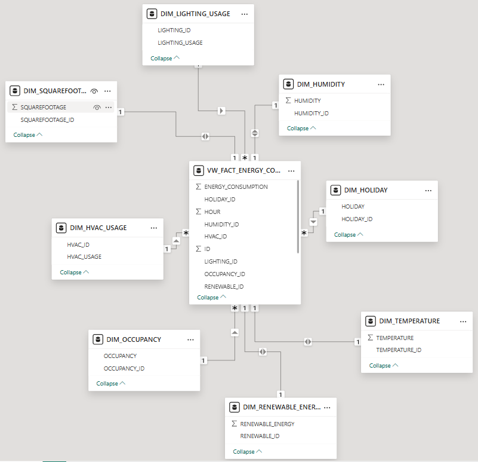

# Energy Consumption Trends and Patterns Analysis

This repository contains a comprehensive project on analyzing energy consumption trends and patterns. The project includes an end-to-end ETL pipeline, database modeling, and a Power BI dashboard for visualizing insights. The main goal of this project is to provide meaningful insights into energy usage using advanced data engineering and analytics techniques.

---

## **📖 Project Overview**
- **📊 Dataset Source**: [Kaggle - Energy Consumption Prediction](https://www.kaggle.com/datasets/mrsimple07/energy-consumption-prediction)
- **🔄 ETL Pipeline**: Extract, transform, and load data into a Snowflake data warehouse.
- **📦 Database Modeling**: Star schema design for optimized querying.
- **📈 Visualization**: Power BI dashboard to analyze energy trends and patterns.

---

## **✨ Features**
1. **🔄 ETL Pipeline**:
   - Extracts data from Kaggle using the Kaggle API.
   - Transforms data (e.g., handling missing values, feature engineering).
   - Loads data into Snowflake while ensuring integrity and preventing duplicates.

2. **📦 Database Modeling**:
   - Designed a star schema with one fact table and multiple dimension tables for efficient querying.
   - Fact table: `vw_fact_energy_consumption`
   - Dimension tables: Temperature, Humidity, Occupancy, HVAC usage, Renewable energy, etc.

3. **📊 Power BI Dashboard**:
   - Interactive visualizations for energy consumption trends.
   - Slicers for date, hour, and temperature filtering.
   - KPI cards for total and average energy consumption.
   - Insights into hourly, daily, and seasonal consumption patterns.

---

## **📂 Repository Structure**

```
├── data/                            # Data folder
│   ├── Energy_consumption.csv       # Raw dataset (downloaded from Kaggle)
│   ├── Energy_consumption_transformed.csv  # Transformed dataset
│
├── etl_pipeline_energy_consumption.py  # ETL pipeline Python script
├── database_modeling.sql            # SQL script for database schema and setup                        
├── database_schema.png          # Database model diagram
├── dashboard_energy_consumption.png  # Power BI dashboard screenshot
│
├── README.md                        # Project documentation
```

---

## **🛠️ Steps to Reproduce**

### **1. Clone the Repository**
```bash
git clone https://github.com/niloysamadder/Energy-Consumption-Trends-and-Patterns-Analysis.git
cd Energy-Consumption-Trends-and-Patterns-Analysis
```

### **2. Set Up Kaggle API**
1. Download your Kaggle API key from your Kaggle account.
2. Save the key as `kaggle.json` in your `.kaggle` folder (e.g., `~/.kaggle/kaggle.json`).
3. Ensure proper permissions:
   ```bash
   chmod 600 ~/.kaggle/kaggle.json
   ```

### **3. Install Dependencies**
Install the required Python libraries:
```bash
pip install pandas kaggle snowflake-connector-python snowflake-sqlalchemy python-dotenv
```

### **4. Set Up Snowflake**
1. Create a `.env` file in the project root and define the following variables:
   ```
   SNOWFLAKE_USER=<your_snowflake_username>
   SNOWFLAKE_PASSWORD=<your_snowflake_password>
   SNOWFLAKE_ACCOUNT=<your_snowflake_account>
   SNOWFLAKE_WAREHOUSE=COMPUTE_WH
   SNOWFLAKE_DATABASE=energy_consumption_db
   SNOWFLAKE_SCHEMA=consumption_schema
   ```
2. Ensure Snowflake is configured correctly.

### **5. Run the ETL Pipeline**
Execute the ETL pipeline script:
```bash
python etl_pipeline_energy_consumption.py
```

### **6. Import Data into Power BI**
1. Connect Power BI to Snowflake.
2. Use the fact and dimension tables to create visualizations.
3. Use the `dashboard_energy_consumption.png` as a reference for creating the dashboard.

---

## **📊 Power BI Dashboard**

### **Key Features**
1. **⭐ KPI Cards**:
   - Total Energy Consumption (kWh)
   - Average Energy Consumption per Day (kWh)
   - Total Renewable Energy Consumption (kWh)

2. **📈 Interactive Charts**:
   - Energy consumption trends by month, day, and hour.
   - Comparison by holiday and non-holiday.
   - Impact of HVAC usage and occupancy on energy consumption.
   - Scatter plot showing the relationship between temperature and energy usage.

3. **🎛️ Slicers**:
   - Date range
   - Hour
   - Temperature range

### **Dashboard Preview**


---

## **📦 Database Model**

### **Star Schema**
The database model follows a star schema design:
- **Fact Table**: `vw_fact_energy_consumption`
- **Dimension Tables**: 
  - `dim_temperature`
  - `dim_humidity`
  - `dim_squarefootage`
  - `dim_occupancy`
  - `dim_hvac_usage`
  - `dim_lighting_usage`
  - `dim_renewable_energy`
  - `dim_holiday`

### **Database Schema**


---

## **🌟 Key Learnings**
1. End-to-end implementation of an ETL pipeline.
2. Database modeling using a star schema for optimized analytics.
3. Advanced Power BI dashboard design for actionable insights.

---

## **🙌 Acknowledgments**
- Dataset: [Kaggle - Energy Consumption Prediction](https://www.kaggle.com/datasets/mrsimple07/energy-consumption-prediction)
- Tools: Python, Snowflake, Power BI

---

## **📧 Contact**
- **GitHub**: [Niloy Samadder](https://github.com/niloysamadder/Energy-Consumption-Trends-and-Patterns-Analysis)
- **LinkedIn**: [Niloy Samadder](https://www.linkedin.com/in/niloy-samadder-a6533a167/)
- **Email**: [niloysamadder.ruet@gmail.com](mailto:niloysamadder.ruet@gmail.com)

---

